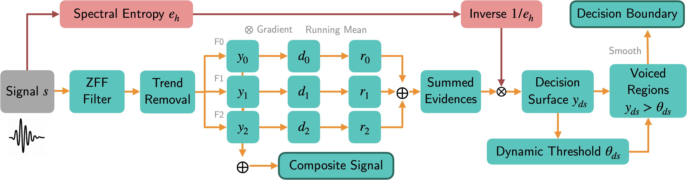

================================================================================================================
ZFF VAD
================================================================================================================

[Paper_]
[Poster_]
[Video_]
[Slides_]

|License| |OpenSource| |BlackFormat| |BanditSecurity| |iSortImports|

Unsupervised Voice Activity Detection by Modeling Source and System Information using Zero Frequency Filtering
---------------------------------------------------------------------------------------------------------------

This repository contains the code developed for the Interspeech accepted paper: `Unsupervised Voice Activity Detection by Modeling Source and System Information using Zero Frequency Filtering`__ by E. Sarkar, R. Prasad, and M. Magimai Doss (2022).

Please cite the original authors for their work in any publication(s) that uses this work:

.. code:: bib

    @inproceedings{sarkar22_interspeech,
    author    = {Eklavya Sarkar and RaviShankar Prasad and Mathew Magimai Doss},
    title     = {{Unsupervised Voice Activity Detection by Modeling Source and System Information using Zero Frequency Filtering}},
    year      = {2022},
    booktitle = {Proc. Interspeech 2022},
    pages     = {4626--4630},
    doi       = {10.21437/Interspeech.2022-10535}
    }

Approach
---------

We jointly model voice source and vocal tract system information using zero-frequency filtering technique for the purpose of voice activity detection. This is computed by combining the ZFF filter outputs together to compose a composite signal carrying salient source and system information, such as the fundamental frequency :math:`$f_0$` and formants :math:`$F_1$` and :math:`$F_2$`, and then applying a dynamic threshold after spectral entropy-based weighting. Our approach operates purely in the time domain, is robust across a range of SNRs, and is much more computationally efficient than other neural methods. 

Installation
------------

This package has very few requirements. 
To create a new conda/mamba environment, install conda_, then mamba_ and simply follow the next steps:

.. code:: bash

    mamba env create -f environment.yml   # Create environment
    conda activate zff                    # Activate environment
    make install clean                    # Install packages

Command-line Usage
-------------------

To segment a single audio file into a .csv file:

.. code:: bash

    segment -w path/to/audio.wav -o path/to/save/segments

To segment a folder of audio files:

.. code:: bash

    segment -f path/to/folder/of/audio/files -o path/to/save/segments

For more options check:

.. code:: bash

    segment -h

*Note*: depending on the conditions of the given data, it will be necessary tune the smoothing and theta parameters.

Python Usage
-------------

To compute VAD on a given audio file:

.. code:: python

    from zff import utils
    from zff.zff import zff_vad

    # Read audio at native sampling rate
    sr, audio = utils.load_audio("audio.wav")

    # Get segments
    boundary = zff_vad(audio, sr)

    # Smooth
    boundary = utils.smooth_decision(boundary, sr)

    # Convert from sample to time domain
    segments = utils.sample2time(audio, sr, boundary)

    # Save as .csv file
    utils.save_segments("segments", "audio", segments)

To extract the composite signal from a given audio file:

.. code:: python

    from zff.zff import zff_cs
    from zff import utils

    # Read audio at native sampling rate
    fs, audio = utils.load_audio("audio.mp3")

    # Get composite signal
    composite = zff_cs(audio, sr)
    

Repository Structure
-----------------------------

.. code:: bash

    .
    ├── environment.yml          # Environment
    ├── img                      # Images
    ├── LICENSE                  # License
    ├── Makefile                 # Setup
    ├── MANIFEST.in              # Setup
    ├── pyproject.toml           # Setup
    ├── README.rst               # README
    ├── requirements.txt         # Setup
    ├── setup.py                 # Setup
    ├── version.txt              # Version
    └── zff                      # Source code folder
        ├── arguments.py            # Arguments parser
        ├── segment.py              # Main method
        ├── utils.py                # Utility methods
        └── zff.py                  # ZFF methods

Contact
-------
For questions or reporting issues to this software package, kindly contact the first author_.
    
.. _author: eklavya.sarkar@idiap.ch
.. _Paper: https://www.isca-speech.org/archive/interspeech_2022/sarkar22_interspeech.html
.. _Poster: https://eklavyafcb.github.io/docs/Sarkar_Interspeech_2022_Poster_Landscape.pdf
.. _Video: https://youtu.be/hIHLu_7ESfM
.. _Slides: https://eklavyafcb.github.io/docs/Sarkar_Interspeech_2022_Presentation.pdf
.. _conda: https://conda.io
.. _mamba: https://mamba.readthedocs.io/en/latest/installation.html#existing-conda-install
__ https://www.isca-speech.org/archive/interspeech_2022/sarkar22_interspeech.html
.. |License| image:: https://img.shields.io/badge/License-GPLv3-blue.svg
    :target: https://github.com/idiap/ZFF_VAD/blob/master/LICENSE
    :alt: License

.. |OpenSource| image:: https://img.shields.io/badge/GitHub-Open%20source-green
    :target: https://github.com/idiap/ZFF_VAD/
    :alt: Open-Source

.. |BlackFormat| image:: https://img.shields.io/badge/code%20style-black-000000.svg
    :target: https://github.com/psf/black
    :alt: Style

.. |BanditSecurity| image:: https://img.shields.io/badge/security-bandit-yellow.svg
    :target: https://github.com/PyCQA/bandit
    :alt: Security

.. |iSortImports| image:: https://img.shields.io/badge/%20imports-isort-%231674b1?style=flat&labelColor=ef8336
    :target: https://pycqa.github.io/isort
    :alt: Imports